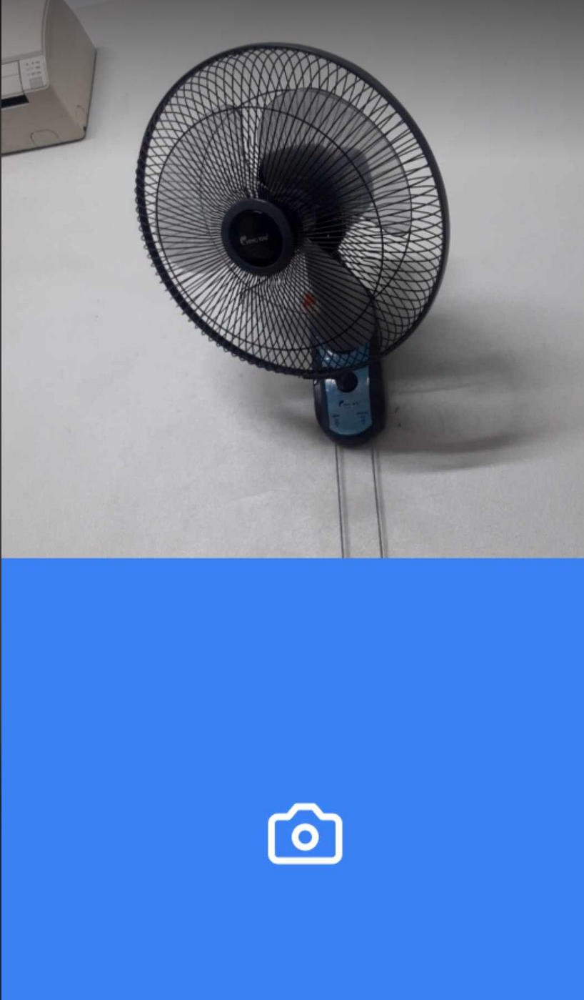
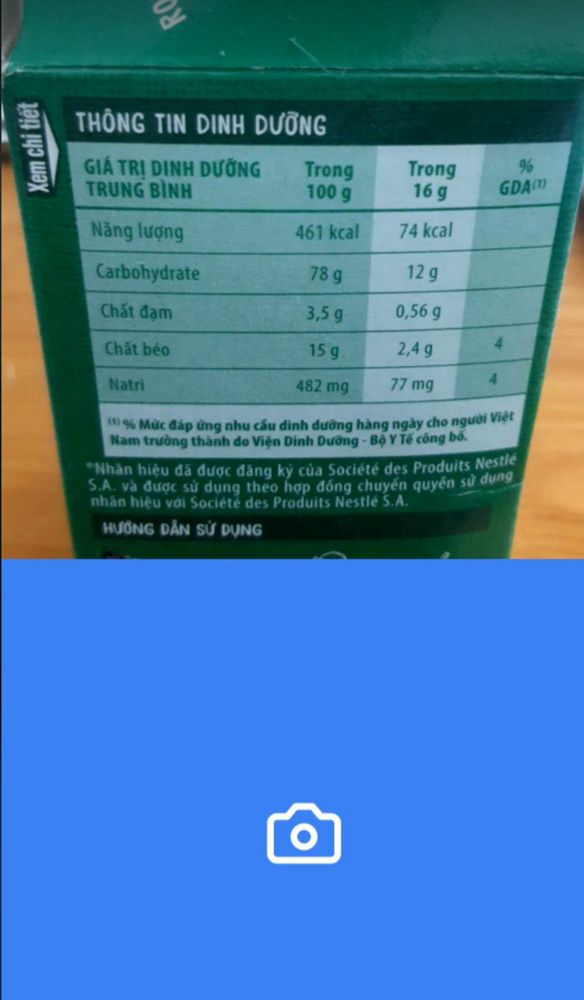

## SeeAI
**`SeeAI`** is an application that utilizes human-machine interaction techniques and leverages artificial intelligence to provide optimal support for visually impaired individuals. Developed with the mission of connecting technology and humanity, SeeAI helps blind and visually impaired people recognize and better understand the world through visual descriptions converted into sound.

## Main features

### Image Captioning 
- Using AI (specifically Vision Language Models), SeeAI describes scenes, objects, people, and surrounding situations through text-to-speech technology.

### Reading text from image
- SeeAI extracts text from images and converts it into clear audio narration for blind and visually impaired users.

## How to interact with SeeAI ? 

- Voice Commands: Users can control and switch the application's state through voice commands.
- Touch Interaction: Users interact with the screen using their fingers for intuitive navigation.
- Audio Feedback: Users receive notifications and instructions from the application through audio feedback.

## Backend
- Deploy with Terraform
- First we use FastAPI to wrap API from `clarifai` but the latency is too high, we need to 

## Frontend
- Complete in web version but the mobile app version is still basic because there're some bugs when set up camera.
- Use React mostly for web and ReactNative for mobile app
